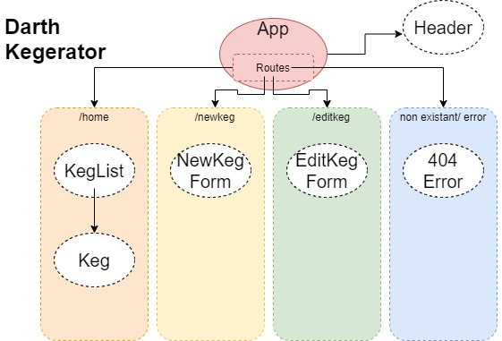

# _Darth Kegerator_

##### _Creating a Taproom React site for Epicodus, 02/14/20_

#### By _**Veronica Stanley-Katz**_

## Description

_This program was designed to imitate the functionality of an electronic taproom board. Employees can add and edit kegs and customers can view current options and see how much is left in the keg._

## Specs

|Specs|Input|Output|
|-|-|-|
|The program should allow an employee to add a keg.| "124oz, %.5, Parsec Pilsner"| Keg List: Parsec Pilsner-%.5-full|
|The program should allow an employee to edit a keg.| Edit "Parsec Pilsner" to "A Galaxy Far, Far Away Ale" |Keg List: A Galaxy Far, Far Away Ale|
|The program should allow anyone to view kegs based on alcohol content.| Sort 🔼|<ul><li>Spacewalk Stout-%.7-75%</li><li>Parsec Pilsner-%.5-full</li></ul>|

<!-- |The program should allow the user to delete a keg. |Delete "A Galaxy Far, Far Away Ale" |Keg List: *empty*| -->

## Setup-Installation Requirements

### To Run Locally
* _Go to_
* _Clone the GitHub repository._
* _In your terminal/command line go into the folder that was cloned and run "npm install"._
* _Once npm install is done downloading all the package dependencies run "npm run start" to start the server._
* _Once the server loads the webpage should load automatically but if not type in the localhost route that your terminal shows._
* _This first view will show you all the kegs, and from here you can chose to edit, update, or add kegs._

## Known Bugs

## Technologies Used
* _HTML_
* _React_
* _JavaScript_
* _CSS_
* _Markup_

### License

Copyright (c) 2019 **_Veronica Stanley-Katz_**

MIT License

Permission is hereby granted, free of charge, to any person obtaining a copy
of this software and associated documentation files (the "Software"), to deal
in the Software without restriction, including without limitation the rights
to use, copy, modify, merge, publish, distribute, sublicense, and/or sell
copies of the Software, and to permit persons to whom the Software is
furnished to do so, subject to the following conditions:

The above copyright notice and this permission notice shall be included in all
copies or substantial portions of the Software.

THE SOFTWARE IS PROVIDED "AS IS", WITHOUT WARRANTY OF ANY KIND, EXPRESS OR
IMPLIED, INCLUDING BUT NOT LIMITED TO THE WARRANTIES OF MERCHANTABILITY,
FITNESS FOR A PARTICULAR PURPOSE AND NONINFRINGEMENT. IN NO EVENT SHALL THE
AUTHORS OR COPYRIGHT HOLDERS BE LIABLE FOR ANY CLAIM, DAMAGES OR OTHER
LIABILITY, WHETHER IN AN ACTION OF CONTRACT, TORT OR OTHERWISE, ARISING FROM,
OUT OF OR IN CONNECTION WITH THE SOFTWARE OR THE USE OR OTHER DEALINGS IN THE
SOFTWARE.
